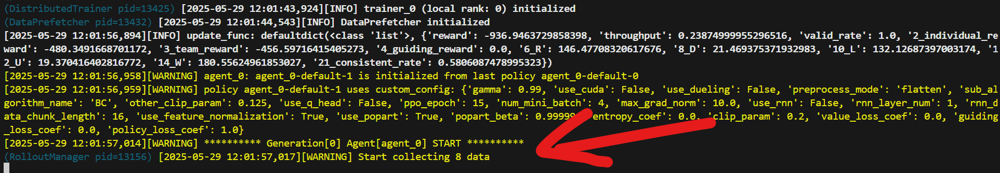

# Deploying Ten Thousand Robots: Scalable Imitaion Learning for Lifelong Multi-Agent Path Finding

## NEWS
1. (2025-05-27) I have uploaded pretrained weights for static guidance on the benchmark of this paper. Please refer to the line 4 of the Table IV in the appendix for reproduction. (using `eval.sh`.)
2. (2025-05-27) I have uploaded pretrained weights for Backward Dijkstra heuristics on the learn-to-follow benchmark. Please refer to the Figure 9 in the appendix for reproduction. (using `eval_ltf.sh`.)
3. (2025-05-28) I have added more explanation for training.

# Static Guidance Version
Due to the complexity of the project, we maintain Backward Dijkstra, Static Guidance and Dynamic Guidance versions in separate branches. This branch is for Static Guidance versions. (The Backward Dijkstra version is almost the same as the Static Guidance version. We only need to set the `map_weights_path` to `""` in all the `expr_configs`.) 

The implementation of Dynamic Guidance Version is more complex than the Static Guidance Version. So, try to run code in the `static_guidance` branch first.

1. For reproduction results of Static Guidance on the main benchmark of this paper, please refer to the line 4 of the Table IV in the appendix. (using `eval.sh`.)

2. For reproduction results of Backward Dijkstra on the main benchmark of this paper, please refer to the line 2 of the Table IV in the appendix.

3. For reporduction results of Backward Dijkstra on the learn-to-follow benchmark. Please refer to the Figure 9 in the appendix. (using `eval_ltf.sh`.)

## Quick Introduction
This repo maintains the code for the paper. There are some other amazing repos involved and maintained in the `lmapf_lib` folder. 
1. [Guided-PIBT](https://github.com/nobodyczcz/Guided-PIBT)
2. [learn-to-follow](https://github.com/AIRI-Institute/learn-to-follow)
3. [MAPFCompetition2023](https://github.com/DiligentPanda/MAPF-LRR2023): The Winning Solution of the League of Robot Runner Competition 2023. The League of Robot Runner Competition 2024 has a stronger winner: [EPIBT](https://github.com/Straple/LORR24), if you are interested in search-based approaches.
4. [RHCR](https://github.com/Jiaoyang-Li/RHCR)

Examples for training and evaluation are provided as scripts below.  All training and evaluation heavily rely on experiment configs in the `expr_configs`. 

But this repo is quite messy now for those who need to modify the internal code, because it involves both complex search- and learning-based methods, builds upon a distributed framework for large-scale training, and contains much more than what we have in the paper.

On the hand, the ideas conveyed by the paper are actually straightforward and it is easy to implement for any other works.

Please contact me (reverse:
moc.liamxof@rivers
) if you have any questions.

## Install Libs & Compile PIBT and LNS
```
./compile.sh
```

## File Structures
1. Configuration files are defined in the folder `expr_configs/paper_exps_v3`.
2. Map reader and generator are defined in the file `light_malib/envs/LMAPF/map.py`. The benchmark data in this paper is in the `lmapf_lib/data/papere_exp_v3` folder. They use the same data format as the competition [League of the Robot Runner 2023](https://github.com/MAPF-Competition/Benchmark-Archive/tree/main/2023%20Competition).
3. Environment is defined in the file `light_malib/envs/LMAPF/env.py`.
4. Training logic is defined in the file `light_malib/framework/ppo_runner.py`.
5. Rollout function (simulation) are defined in the file `light_malib/rollout/rollout_func_LMAPF.py`.
6. Neural network models are defined in the folder `light_malib/model/LMAPF`.
7. Pretrained weights are in the folder `pretrained_models`.
8. The training logs are by default in the folder `logs`. Tensorboard can be used to monitor the training. The subfolder `agent_0` will contain the weight checkpoints.
9. There are several important c++ wrappers for `PIBT` and `Parallel LNS` defined in the files `lmapf_lib/MAPFCompetition2023/tools/py_PIBT.cpp` and `lmapf_lib/MAPFCompetition2023/tools/py_PLNS.cpp`. Backward Dijkstraj heuristics are precomputed by the c++ wrapper defined in the file `lmapf_lib/MAPFCompetition2023/tools/py_compute_heuristics.cpp`. For example, in the environment class `LMAPFEnv`, you can see how they are loaded.

## Evaluation
See `eval.sh` for how to evaluate on the benchmark of this paper.
See `eval_ltf.sh` for how to evaluate on the benchmark of the learn-to-follow paper.

## Training
See `train.sh`. The training successfully starts for imiation learning if you see something similar to the following figure, which states that the algorithm starts to collecting training data.



### Configuration of experiments
Please take a look at lines with **NOTE** in comments in the example configuration file `expr_configs/paper_exps_v3/small/bootstrap_from_pibt_iter1_sortation_small_a600_s500_none_annotated_1gpu.yaml`. These lines are those ones you probably want to modify in your experiments.

### Computational Resources
I usually train models with 4 RTX4090D (24GB) and roughly 64 vCPUs. But since it is imitation learning fundamentally, less computational resources also work (need to modifythe experiment configs). 

`expr_configs/paper_exps_v3/small/bootstrap_from_pibt_iter1_sortation_small_a600_s500_none_annotated_1gpu.yaml` gives an example for 1 RTX4090D (24GB memory) and 16 vCPUs (80GB memory).

Depending on the numbers of CPUs, GPUs and their memories: you may need to adjust the following parameters in the configuration files:
1. framework
    1. max_dagger_iterations
    2. num_episodes_per_iter
2. evaluation_manager:
    1. num_eval_rollouts
3. rollout_manager:g
    1. num_workers: the number of works to collect data. must < the total number of cpus. because some other cpus are used for other processes according to the design of the distributed computation framework, Ray.
    2. batch_size
    3. eval_batch_size
3. training_manager
    1. batch_size: should be kept the same as the `rollout_manager.batch_size`.
    2. num_trainers: should be set the number of GPUs to use.

For example, the default number in other configurations is for 4 GPUs and 64 vCPUs and if you want to use 1 GPUs and 16 vCPUs, you can divide the number of `rollout_manager.num_workers` and `training_manger.num_trainers` by 4. Since you probably don't want to wait for too long in the training because of the reduction in computational resources, you can divide other parameters mentioned above by 4. (CPU and GPU memories might also be the reason for reducing these parameters.)

### Generate New Problem Instances (Agent Starts and Task Locations) for a Map
You can take a look at the last tens of lines in the file `light_malib/envs/LMAPF/map.py`. We use the same data format as the competition [League of the Robot Runner 2023](https://github.com/MAPF-Competition/Benchmark-Archive/tree/main/2023%20Competition).

## TODO
1. recompile everything in an empty env to check the dependencies.
2. add more documentation.
3. organize/re-write code.